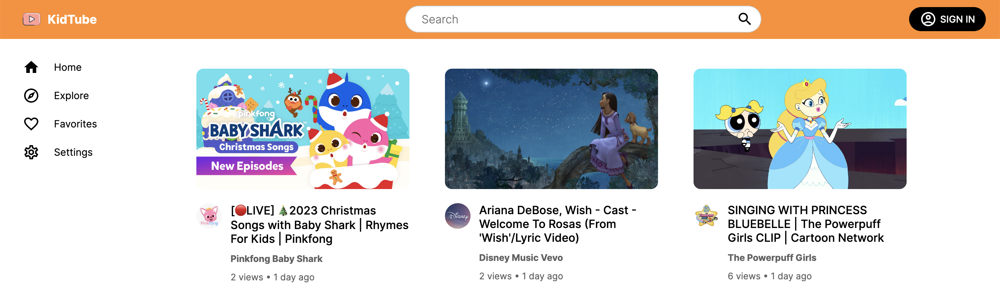

# KidTube        
A video sharing platform designed for kids. 
 
The full-stack web application is developed using React, Redux, Next, Express and MongoDB. 
 
You can access the `Vercel` deployment here: [KidTube](https://kidtube-frontend.vercel.app/)

 

## Tech Stack
* `Node`, `Express` - server
* `React`, `HTML/CSS` - frontend UI
* `Redux` - state management
* `Axios` - HTTP requests from node.js
* `MongoDB` - NoSQL database
* `Firebase` - image and video storage
* `Postman` - API testing
* `Jest` - Unit Testing
* `Figma` - UI design/prototype

**Please ensure that you have `node` version `v18.18.2` and `npm` version `9.8.1` installed**

## Contributors
* [Vignesh](https://github.com/Vignesh0404)
* [Dhanny Indrakusuma](https://github.com/dhannywi)

